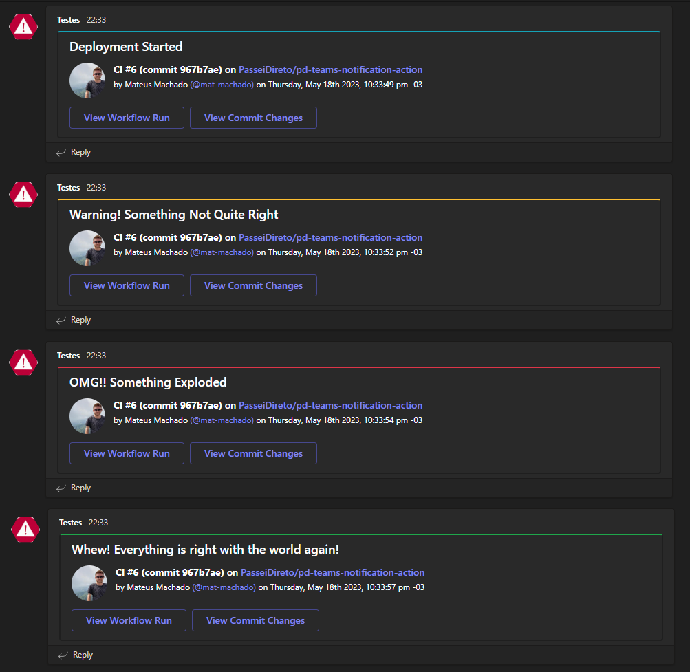

<p align="center">
  <a href="https://github.com/PasseiDireto/pd-teams-notification-action/actions"></a>
</p>

# Microsoft Teams Notification 
A GitHub Action that sends customizable notifications to a dedicated Microsoft Teams channel.

## Usage
1. Add `MS_TEAMS_WEBHOOK_URI` on your repository's configs on Settings > Secrets and variables > actions > Variables. It is the [Webhook URI](https://docs.microsoft.com/en-us/microsoftteams/platform/webhooks-and-connectors/how-to/add-incoming-webhook) of the dedicated Microsoft Teams channel for notification.

2) Add a new `step` on your workflow code below `actions/checkout@v4`:

```yaml
name: MS Teams Notification

on:
    push:
        branches: ["main"]
    pull_request:

jobs:
  build:
    runs-on: ubuntu-latest

    steps:
      - name: Checkout the code
        uses: actions/checkout@v4
      # this is the new step using the ms-teams-notification action
      - name: Notify dedicated teams channel
        uses: PasseiDireto/pd-teams-notification-action@main
        with:
          github-token: ${{ github.token }} # this will use the runner's token.
          ms-teams-webhook-uri: ${{ secrets.MS_TEAMS_WEBHOOK_URI }}
          notification-summary: Your custom notification message 
          notification-color: 17a2b8
          timezone: America/Sao_Paulo
```

```yaml
name: MS Teams Notification use microsoft workflow

on:
    push:
        branches: ["main"]
    pull_request:

jobs:
  build:
    runs-on: ubuntu-latest

    steps:
      - name: Checkout the code
        uses: actions/checkout@v4
      # this is the new step using the ms-teams-notification action
      - name: Notify dedicated teams channel
        uses: PasseiDireto/pd-teams-notification-action@main
        with:
          github-token: ${{ github.token }} # this will use the runner's token.
          workflow-teams-webhook-uri: ${{ secrets.MS_TEAMS_WEBHOOK_URI }}
          notification-summary: Your custom notification message 
          notification-color-workflow: good
          timezone: America/Sao_Paulo
```

3. Make it your own with the following configurations.
   - `github-token` - (required), set to the following:
     - `${{ github.token }}`
   - `webhook-uri` - If use microsoft workflow this parameter is optional, setup a new secret to store your Microsoft Teams Webhook URI (ex. `MS_TEAMS_WEBHOOK_URI`). Learn more about setting up [GitHub Secrets](https://help.github.com/en/actions/configuring-and-managing-workflows/creating-and-storing-encrypted-secrets) or [Microsoft Teams Incoming Webhook](https://docs.microsoft.com/en-us/microsoftteams/platform/webhooks-and-connectors/how-to/add-incoming-webhook).
   - `workflow-teams-webhook-uri` - If use incoming webhook this parameter is optional, setup a new secret to store your Microsoft Teams Webhook URI (ex. `MS_TEAMS_WEBHOOK_URI`). Learn more about setting up [GitHub Secrets](https://help.github.com/en/actions/configuring-and-managing-workflows/creating-and-storing-encrypted-secrets) or [Microsoft Teams Incoming Webhook](https://docs.microsoft.com/en-us/microsoftteams/platform/webhooks-and-connectors/how-to/add-incoming-webhook).
   - `notification-summary` (required), Your custom notification message (ex. Deployment Started or Build Successful)
   - `notification-color` - If use microsoft workflow this parameter is optional, Custom color to help distinguish type of notification. Can be any [HEX color](https://html-color.codes/). (ex. **007bff** or **17a2b8** for info, **28a745** success, **ffc107** warning, **dc3545** error, etc.)
   - `notification-color-workflow` - If use incoming webhook this parameter is optional, Custom color to help distinguish type of notification. The options can be used are: (**accent**  for info, **good** for success, **attention** for error, **warning** for warning)
   - `timezone` - (optional, defaults to `America/Sao_Paulo`), a [valid database timezone name](https://en.wikipedia.org/wiki/List_of_tz_database_time_zones), (ex. Australia/Sydney or America/Denver, etc.)

## Examples
As you can see below, the `notification-summary` and `notification-color` are being used to customize the appearance of the message. Use bright vibrant colors to notify your Microsoft Teams channel of warnings or errors in your GitHub Actions workflow.

<p align="center">

</p>

### Emojis (Current not Working)
Emoji support isn't great for incoming webhooks on Microsoft Teams yet. You can hack your way through it using HEX codes. For example, in `notification-summary` I used `Emojify! &#x1F6A2​​ &#x2705;` for the following screenshot. HEX codes for emojis [here](https://apps.timwhitlock.info/emoji/tables/unicode).
